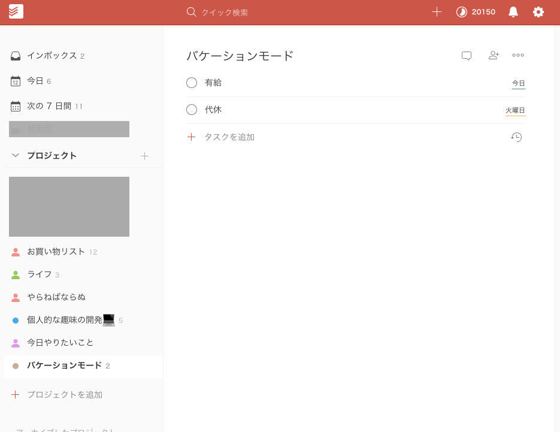

Serverless Todoist Vacation Mode Controller
====

## Description

祝日情報を取得し、TodoistのバケーションモードのON/OFFを自動切り替えを行う、ServerlessApplication(Python3.6)

ON/OFFが行われるとLINEに通知を送る

## Requirement

- https://github.com/Doist/todoist-python
- https://github.com/golbin/line-notify

## Usage

- 一度下記Installに従ってデプロイすれば、スケジュールに従って定期実行してくれます
    - 初期値は毎日午前9時(UTC00:00)
    - 祝日情報は都度googleに問い合わせるので、アップデートは不要
- 専用のTodoistプロジェクトを作成し、タスクの締切日を任意でバケーションモードに登録したい日で設定しておくと、  
祝日以外の任意の日もバケーションモードをONにしてくれます
    - 有給や代休などに使用できます
    

## Install

1. AWSにて、severless deploy用のIAMを作成し、keyとaccess tokenを取得 
2. Todoistの自分のAPIトークンを取得(マイページにある)
3. Todoistに任意のプロジェクトを作成しIDを取得(URLパラメータ内)
3. [LineNotify](https://notify-bot.line.me/my/)のトークンを取得
4. `.env`に上記の各種key,tokenを記載
5. `cp ./.env.local ./.env`
6. `docker-compose build`
7. `docker-compose up -d`
8. `docker-compose exec serverless bash -c 'sls deploy -s #{stage}'`

## Licence

[MIT](https://github.com/aiji42/serverless-auto-control-todoist/blob/master/LICENSE)

## Author

[AijiUejima](https://github.com/aiji42)
